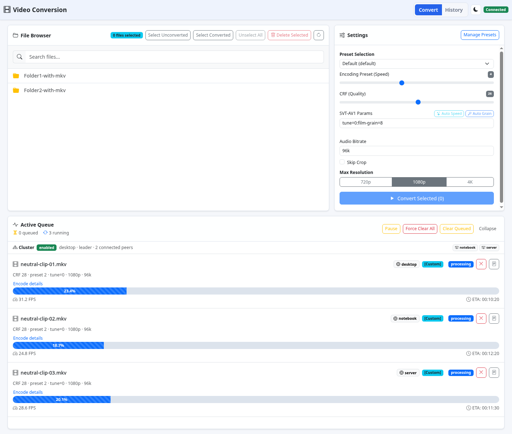
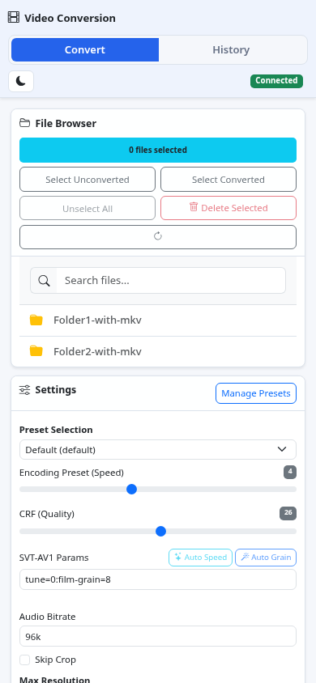

[](https://github.com/fabianwimberger/archive-video-av1/actions)
[](https://codecov.io/gh/fabianwimberger/archive-video-av1)
[](https://github.com/fabianwimberger/archive-video-av1/pkgs/container/archive-video-av1)
[](https://opensource.org/licenses/MIT)

# Video Conversion Service

A self-hosted, web-based video conversion service running in Docker. Converts video files to AV1 (via SVT-AV1) with real-time progress tracking, batch processing, and an intuitive browser UI.

## Background

AV1 saves 30-50% on file size versus H.264, but encoding is slow and most tools are CLI-only. This runs SVT-AV1 behind a browser UI so batch jobs can be queued, watched, and retried without shell access. Presets cover live-action, animated, and grainy sources.

| Desktop | Mobile |
|---------|--------|
|  |  |

## Features

- **Responsive web UI** with file browsing, queue controls, history filters, and real-time progress via WebSocket
- **AV1 encoding** using SVT-AV1 with PGO-optimized FFmpeg
- **Batch processing** with sequential job queue
- **Distributed processing** with opt-in LAN peer discovery and remote job delegation
- **Persistent** — conversion history, custom presets, and queue state survive restarts
- **Conversion presets:**
  - **Default** — CRF 26, film grain preservation (`film-grain=8`)
  - **Animated** — CRF 35, tune=0 (visual quality) — optimized for animated content
  - **Grainy** — CRF 26, heavy grain preservation (`film-grain=16:film-grain-denoise=1`)
  - **Custom presets** — create, edit, duplicate, import/export your own presets
- **Automatic crop detection** (consensus-based, 8-point sampling)
- **Two-pass audio normalization** (loudnorm, Opus stereo output)
- **Configurable track selection** (default: German > English > first available)
- **Skips re-encoding** if source is already AV1
- **History view** with filtering, search, retry, and per-job settings inspection
- **Mobile and desktop layouts** with touch-friendly controls and compact queue/history views

## Quick Start

### Option 1: Using Pre-built Image (Recommended)

Pre-built images support both **AMD64** and **ARM64** architectures.

**Docker Compose:**

```bash
# Clone the repository for docker-compose.yml
git clone https://github.com/fabianwimberger/archive-video-av1.git
cd archive-video-av1

# Configure volume mount in docker-compose.yml
# volumes:
#   - /path/to/your/videos:/videos

# Run with pre-built image
docker compose up -d

# Open UI at http://localhost:8000
```

**Or with docker run:**

```bash
docker run -d \
  --name convert-service \
  --restart unless-stopped \
  -p 8000:8000 \
  -v /path/to/your/videos:/videos \
  -v archive-video-av1-data:/app/data \
  -e TZ=UTC \
  -e SOURCE_MOUNT=/videos \
  -e LOG_LEVEL=INFO \
  -e AUDIO_TRACK_MODE=preferred \
  -e SUBTITLE_TRACK_MODE=preferred \
  -e PREFERRED_AUDIO_LANGUAGES=ger,deu,de,eng,en \
  -e PREFERRED_SUBTITLE_LANGUAGES=ger,deu,de,eng,en \
  ghcr.io/fabianwimberger/archive-video-av1:latest
```

### Option 2: Build from Source (with PGO optimization)

```bash
# Clone the repository
git clone https://github.com/fabianwimberger/archive-video-av1.git
cd archive-video-av1

# Copy the override file to configure your video path
cp docker-compose.override.yml.example docker-compose.override.yml

# Edit the override file to set your video path:
# volumes:
#   - /path/to/your/videos:/videos

# Build and run (PGO enabled by default for maximum performance)
make build
make up

# Or using docker compose directly:
# docker compose build --build-arg ENABLE_PGO=true --build-arg ENABLE_LTO=true --build-arg ARCH_FLAGS=-march=native
# docker compose up -d

# Open UI at http://localhost:8000
```

### Available Image Tags

The following image tags are available from `ghcr.io/fabianwimberger/archive-video-av1`:

| Tag | Description |
|-----|-------------|
| `main` | Latest development build from main branch |
| `v1.2.3` | Specific release version |
| `v1.2` | Latest patch release in the v1.2.x series |
| `v1` | Latest minor release in the v1.x.x series |
| `<short-sha>` | Specific commit SHA (e.g., `abc1234`)

### Updating

```bash
# Pull latest image
docker compose pull
docker compose up -d

# Or with docker run
docker pull ghcr.io/fabianwimberger/archive-video-av1:latest
docker restart convert-service
```

## Web UI

Open `http://localhost:8000` after starting the container.

- **Convert** — browse mounted `.mkv` files, search within the current folder, select unconverted files for encoding, or select converted originals for cleanup.
- **Settings** — choose a preset, adjust CRF, encoder speed, SVT-AV1 parameters, audio bitrate, crop detection, and maximum resolution.
- **Auto Speed / Auto Grain** — analyze the selected file and apply a suggested preset or grain settings.
- **Active Queue** — watch running jobs, cluster status, pause or resume processing, cancel jobs, clear queued work, and inspect logs for active encodes.
- **History** — filter completed, failed, or cancelled jobs; inspect settings and logs; retry jobs; save settings as a preset; export the current page to CSV.

## How It Works

1. **File browser** shows `.mkv` files from the mounted volume
2. **Select files** and choose conversion settings
3. **Jobs are queued** and processed sequentially in the background
4. **FFmpeg pipeline per file:**
   - Detect video codec (skip re-encode if AV1)
   - Crop detection via 8-point consensus sampling
   - Two-pass loudnorm audio measurement and normalization
   - Configurable audio and subtitle stream selection
   - SVT-AV1 encoding with progress output
   - `mkvmerge` finalization with metadata
5. **Real-time updates** are pushed to the browser via WebSocket
6. **Output** is saved alongside the source with `_conv` suffix

## Presets

Presets are stored in the SQLite database and survive restarts.

- **Built-in presets** (`Default`, `Animated`, `Grainy`) are seeded automatically and synced on startup. They cannot be edited or deleted, but you can duplicate them to create user presets.
- **User presets** can be created from the settings panel, or saved from any past job's settings snapshot.
- **Import / Export** — share presets as JSON documents via the Manage Presets modal.
- **Default preset** — one preset can be marked as default; it is pre-selected in the UI on load.

## Configuration

### Environment Variables

| Variable | Default | Description |
|----------|---------|-------------|
| `SOURCE_MOUNT` | `/videos` | Mount point for source video files |
| `TEMP_DIR` | `/app/temp` | Temporary directory for in-progress conversions |
| `DATABASE_PATH` | `/app/data/app.db` | SQLite database path (persistent) |
| `LOG_LEVEL` | `INFO` | Logging level (`DEBUG`, `INFO`, `WARNING`, `ERROR`) |
| `AUDIO_TRACK_MODE` | `preferred` | Audio stream mode: `preferred` selects one track and normalizes it, `all` copies all audio tracks |
| `SUBTITLE_TRACK_MODE` | `preferred` | Subtitle stream mode: `preferred` selects one matching track, `all` copies all subtitle tracks, `none` drops subtitles |
| `PREFERRED_AUDIO_LANGUAGES` | `ger,deu,de,eng,en` | Comma-separated language preference order used when `AUDIO_TRACK_MODE=preferred` |
| `PREFERRED_SUBTITLE_LANGUAGES` | `ger,deu,de,eng,en` | Comma-separated language preference order used when `SUBTITLE_TRACK_MODE=preferred` |
| `JOB_HISTORY_RETENTION_DAYS` | `0` | Delete finished jobs older than N days (`0` = keep forever) |
| `JOB_HISTORY_MAX_ROWS` | `0` | Maximum number of finished jobs to keep (`0` = unlimited) |
| `DISTRIBUTED_ENABLED` | `false` | Enable LAN peer discovery and remote job delegation |
| `DISTRIBUTED_NODE_ID` | container hostname | Stable node identifier advertised to peers |
| `DISTRIBUTED_NODE_NAME` | `DISTRIBUTED_NODE_ID` | Display name for this worker node |
| `DISTRIBUTED_PUBLIC_URL` | `http://<hostname>:8000` | URL other nodes use to reach this service |
| `DISTRIBUTED_LEADER_URL` | empty | Optional pinned leader URL; when empty, nodes elect a live leader automatically |
| `DISTRIBUTED_PEERS` | empty | Comma-separated peer URLs used when multicast discovery is unavailable |
| `DISTRIBUTED_DISCOVERY_GROUP` | `239.255.42.99` | Multicast group for peer discovery |
| `DISTRIBUTED_DISCOVERY_PORT` | `9988` | UDP port for peer discovery |
| `DISTRIBUTED_HEARTBEAT_SECONDS` | `5` | Peer heartbeat and coordination interval |
| `DISTRIBUTED_PROGRESS_SECONDS` | `1` | Remote worker progress sync interval |
| `DISTRIBUTED_PEER_TTL_SECONDS` | `20` | Seconds before a silent peer is removed |
| `TZ` | `UTC` | Container timezone |

## Distributed Processing

Distributed mode lets several trusted LAN devices run the container and share AV1 jobs. Queue jobs from any node; non-leader nodes forward queue changes to the current leader, the leader delegates pending work to discovered idle peers, and every node shows the same cluster-wide active queue with worker assignments. By default, nodes use a deterministic tie-break when no leader is known, then keep the current leader until it disappears. Set `DISTRIBUTED_LEADER_URL` only when you want to pin one coordinator.

Cluster state is shown in the Active Queue panel and is also available at `/api/cluster/status`. Active job listings include peer jobs by default; pass `cluster=false` to `/api/jobs` when a node-local view is needed. The leader replicates pending and active queue rows to followers every coordination interval so a newly elected leader can continue scheduling visible queue work.

Requirements:

- All participating nodes must mount the same media library at the same in-container `SOURCE_MOUNT` path.
- Every node must be reachable from every other node through `DISTRIBUTED_PUBLIC_URL`.
- For automatic leader election, leave `DISTRIBUTED_LEADER_URL` empty on every node and use stable, unique `DISTRIBUTED_NODE_ID` values.
- The network must allow UDP multicast on `DISTRIBUTED_DISCOVERY_PORT`, or `DISTRIBUTED_PEERS` must list peer URLs explicitly.
- Docker host networking is the most reliable option for multicast discovery; otherwise use `DISTRIBUTED_PEERS`.
- For three or more nodes, set each node's `DISTRIBUTED_PEERS` to the comma-separated URLs of the other nodes.
- The service has no built-in authentication, so only enable distributed mode on a trusted network.

Compose node commands:

```bash
# Build the local node image with the distributed compose stack
make node-build

# Start the node with docker-compose.override.yml and docker-compose.cluster.yml
make node-up

# Recreate the node after code or image changes
make node-recreate

# Stop the node stack without deleting volumes
make node-down
```

`docker compose up -d` auto-loads `docker-compose.override.yml` only for the default compose stack. Distributed nodes must include `docker-compose.cluster.yml`, so use the node targets above or pass all compose files explicitly.

Example with explicit peers:

```bash
docker run -d \
  --name convert-service-node-a \
  --restart unless-stopped \
  -p 8000:8000 \
  -v /mnt/media:/videos \
  -v archive-video-av1-node-a:/app/data \
  -e SOURCE_MOUNT=/videos \
  -e DISTRIBUTED_ENABLED=true \
  -e DISTRIBUTED_NODE_ID=notebook \
  -e DISTRIBUTED_NODE_NAME=notebook \
  -e DISTRIBUTED_PUBLIC_URL=http://192.168.1.10:8000 \
  -e DISTRIBUTED_PEERS=http://192.168.1.11:8000,http://192.168.1.12:8000 \
  ghcr.io/fabianwimberger/archive-video-av1:latest
```

If a worker disappears while it is processing a delegated job, the leader requeues that job after the worker has aged out of the peer list. If the leader disappears, the next elected leader promotes its replicated queue copy and continues scheduling from there. Jobs created just before a leader fails can only fail over after they have reached at least one follower.

## Security

No built-in authentication — intended for trusted networks or behind a reverse proxy with auth. Bind to `127.0.0.1:8000:8000` to restrict access to localhost.

## License

MIT License — see [LICENSE](LICENSE) file.

### Third-Party Licenses

This software includes the following open-source components:

| Component | License | Source |
|-----------|---------|--------|
| FFmpeg | [GPL v2+](https://www.gnu.org/licenses/old-licenses/gpl-2.0.html) | https://git.ffmpeg.org/ffmpeg.git |
| SVT-AV1 | [BSD-3-Clause](https://gitlab.com/AOMediaCodec/SVT-AV1/-/blob/master/LICENSE.md) | https://gitlab.com/AOMediaCodec/SVT-AV1 |
| Opus | [BSD-3-Clause](https://opus-codec.org/license/) | https://opus-codec.org/ |

When using the pre-built Docker image, FFmpeg is compiled with GPL enabled. The FFmpeg license notice is included in the image at `/usr/share/licenses/FFmpeg-LICENSE`.
