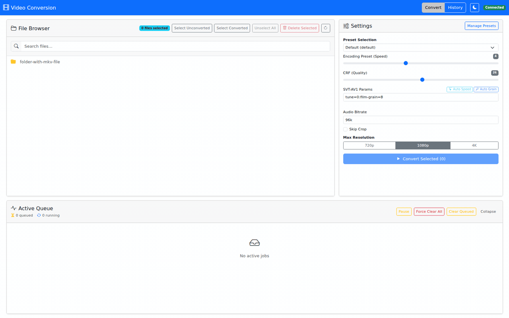

# Video Conversion Service

[](https://github.com/fabianwimberger/archive-video-av1/actions)
[](https://github.com/fabianwimberger/archive-video-av1/pkgs/container/archive-video-av1)
[](https://opensource.org/licenses/MIT)

A self-hosted, web-based video conversion service running in Docker. Converts video files to AV1 (via SVT-AV1) with real-time progress tracking, batch processing, and an intuitive browser UI.

> **⚠️ Upgrade Note (v0.6.0):** This release introduces a new persistent database schema. Before upgrading, remove the previous data volume to avoid compatibility issues:
> ```bash
> docker compose down
> docker volume rm archive-video-av1_app-data  # or your project's data volume
> docker compose up -d
> ```

## Why This Project?

AV1 offers superior compression efficiency compared to H.264 and H.265, reducing file sizes by 30-50% while maintaining quality. However, AV1 encoding is computationally intensive and most existing tools are either CLI-only or require complex setups. This project provides a simple, web-based interface for batch converting video libraries to AV1 without sacrificing quality.

**Goals:**
- Provide a simple web UI for AV1 batch conversion
- Optimize encoding quality per content type (live-action, animated, grainy)
- Track progress in real-time without CLI complexity

<p align="center">
  
  <br><em>Browse files, select a preset, convert — with real-time progress tracking</em>
</p>

## Features

- **Web UI** with real-time progress (FPS, ETA, percentage) via WebSocket
- **AV1 encoding** using SVT-AV1 with PGO-optimized FFmpeg
- **Batch processing** with sequential job queue
- **Persistent** — conversion history, custom presets, and queue state survive restarts
- **Conversion presets:**
  - **Default** — CRF 26, film grain preservation (`film-grain=8`)
  - **Animated** — CRF 35, tune=0 (visual quality) — optimized for animated content
  - **Grainy** — CRF 26, heavy grain preservation (`film-grain=16:film-grain-denoise=1`)
  - **Custom presets** — create, edit, duplicate, import/export your own presets
- **Automatic crop detection** (consensus-based, 8-point sampling)
- **Two-pass audio normalization** (loudnorm, Opus stereo output)
- **Language-aware track selection** (German > English > first available)
- **Skips re-encoding** if source is already AV1
- **History view** with filtering, search, retry, and per-job settings inspection

## Quick Start

### Option 1: Using Pre-built Image (Recommended)

Pre-built images support both **AMD64** and **ARM64** architectures.

**Docker Compose:**

```bash
# Clone the repository for docker-compose.yml
git clone https://github.com/fabianwimberger/archive-video-av1.git
cd archive-video-av1

# Configure volume mount in docker-compose.yml
# volumes:
#   - /path/to/your/videos:/videos

# Run with pre-built image
docker compose up -d

# Open UI at http://localhost:8000
```

**Or with docker run:**

```bash
docker run -d \
  --name convert-service \
  --restart unless-stopped \
  -p 8000:8000 \
  -v /path/to/your/videos:/videos \
  -v archive-video-av1-data:/app/data \
  -e TZ=UTC \
  -e SOURCE_MOUNT=/videos \
  -e LOG_LEVEL=INFO \
  ghcr.io/fabianwimberger/archive-video-av1:latest
```

### Option 2: Build from Source (with PGO optimization)

```bash
# Clone the repository
git clone https://github.com/fabianwimberger/archive-video-av1.git
cd archive-video-av1

# Copy the override file to configure your video path
cp docker-compose.override.yml.example docker-compose.override.yml

# Edit the override file to set your video path:
# volumes:
#   - /path/to/your/videos:/videos

# Build and run (PGO enabled by default for maximum performance)
make build
make up

# Or using docker compose directly:
# docker compose build --build-arg ENABLE_PGO=true --build-arg ENABLE_LTO=true --build-arg ARCH_FLAGS=-march=native
# docker compose up -d

# Open UI at http://localhost:8000
```

### Available Image Tags

The following image tags are available from `ghcr.io/fabianwimberger/archive-video-av1`:

| Tag | Description |
|-----|-------------|
| `main` | Latest development build from main branch |
| `v1.2.3` | Specific release version |
| `v1.2` | Latest patch release in the v1.2.x series |
| `v1` | Latest minor release in the v1.x.x series |
| `<short-sha>` | Specific commit SHA (e.g., `abc1234`)

### Updating

```bash
# Pull latest image
docker compose pull
docker compose up -d

# Or with docker run
docker pull ghcr.io/fabianwimberger/archive-video-av1:latest
docker restart convert-service
```

## How It Works

1. **File browser** shows `.mkv` files from the mounted volume
2. **Select files** and choose conversion settings
3. **Jobs are queued** and processed sequentially in the background
4. **FFmpeg pipeline per file:**
   - Detect video codec (skip re-encode if AV1)
   - Crop detection via 8-point consensus sampling
   - Two-pass loudnorm audio measurement and normalization
   - SVT-AV1 encoding with progress output
   - `mkvmerge` finalization with metadata
5. **Real-time updates** are pushed to the browser via WebSocket
6. **Output** is saved alongside the source with `_conv` suffix

## Presets

Presets are stored in the SQLite database and survive restarts.

- **Built-in presets** (`Default`, `Animated`, `Grainy`) are seeded automatically and synced on startup. They cannot be edited or deleted, but you can duplicate them to create user presets.
- **User presets** can be created from the settings panel, or saved from any past job's settings snapshot.
- **Import / Export** — share presets as JSON documents via the Manage Presets modal.
- **Default preset** — one preset can be marked as default; it is pre-selected in the UI on load.

## Configuration

### Environment Variables

| Variable | Default | Description |
|----------|---------|-------------|
| `SOURCE_MOUNT` | `/videos` | Mount point for source video files |
| `TEMP_DIR` | `/app/temp` | Temporary directory for in-progress conversions |
| `DATABASE_PATH` | `/app/data/app.db` | SQLite database path (persistent) |
| `LOG_LEVEL` | `INFO` | Logging level (`DEBUG`, `INFO`, `WARNING`, `ERROR`) |
| `JOB_HISTORY_RETENTION_DAYS` | `0` | Delete finished jobs older than N days (`0` = keep forever) |
| `JOB_HISTORY_MAX_ROWS` | `0` | Maximum number of finished jobs to keep (`0` = unlimited) |
| `TZ` | `UTC` | Container timezone |

## Security

No built-in authentication — intended for trusted networks or behind a reverse proxy with auth. Bind to `127.0.0.1:8000:8000` to restrict access to localhost.

## License

MIT License — see [LICENSE](LICENSE) file.

### Third-Party Licenses

This software includes the following open-source components:

| Component | License | Source |
|-----------|---------|--------|
| FFmpeg | [GPL v2+](https://www.gnu.org/licenses/old-licenses/gpl-2.0.html) | https://git.ffmpeg.org/ffmpeg.git |
| SVT-AV1 | [BSD-3-Clause](https://gitlab.com/AOMediaCodec/SVT-AV1/-/blob/master/LICENSE.md) | https://gitlab.com/AOMediaCodec/SVT-AV1 |
| Opus | [BSD-3-Clause](https://opus-codec.org/license/) | https://opus-codec.org/ |

When using the pre-built Docker image, FFmpeg is compiled with GPL enabled. The FFmpeg license notice is included in the image at `/usr/share/licenses/FFmpeg-LICENSE`.
